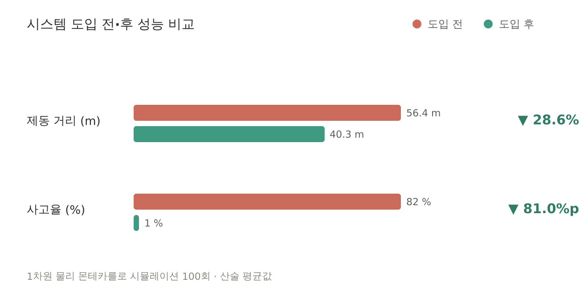

# 대형차량 전방 위험 VIS 경고 시스템

대형 화물차·버스는 차체가 커서 **후방 차량의 전방 시야를 차단**합니다. 뒤차 운전자는
앞에서 벌어지는 급정거·보행자 진입을 볼 수 없고, 앞차의 브레이크등을 본 뒤에야
반응하므로 그만큼 제동이 늦어집니다. 이 프로젝트는 **대형차에 장착된 카메라가
YOLOv8로 전방 위험을 감지해, UDP로 후방 차량에 경고를 전달**하는 시스템입니다.

이 저장소는 공학 분야 공모전 제안서의 **근거 자료**로 공개됩니다. 제안서에 인용된
수치는 모두 여기의 코드와 원본 데이터로 재현할 수 있으며, 재현 방법과 측정 조건을
각 `experiments/` 하위 문서에 기록했습니다. 측정의 한계와 미달 항목도 함께
적어두었습니다 — 수치만 있고 조건이 없는 자료는 검증이 불가능하기 때문입니다.

> **정량 검증은 전부 실측·해석 모델 기반입니다.** 지연시간은 실기기 측정, 영향도는
> 1차원 물리 몬테카를로 시뮬레이션(100회)입니다. 물리 엔진 계측값이 아닙니다.

---

## 프로젝트 소개

고속도로와 간선도로에서 대형 화물차 뒤를 주행할 때, 후방 차량은 전방 상황을 볼 수
없습니다. 신호등·보행자·급정거 차량을 인지하지 못한 채 앞차의 브레이크등에만 의존해
반응하는 구조적 문제입니다.

- 대형 화물차는 후방 차량의 시야를 **3.5–4 m 높이로 차단**
- 브레이크등에만 의존할 경우 시속 100 km에서 **제동 시작까지 28–42 m 추가 이동**
- 실제 주행영상 스캔에서 앞차가 화면의 **최대 34 %를 가리는 장면**을 확인
  (`experiments/blackbox_scan/candidates/selected/`)

이 프로젝트는 대형차의 전방 카메라 영상을 **YOLOv8로 온디바이스 분석**하고, 위험
상황을 **IP 기반 UDP로 후방 차량에 전달**하는 시야 공유 시스템입니다. 클라우드 추론
서버나 도로 인프라 없이 **단말 단독**으로 동작하는 것이 핵심 설계 원칙입니다.

---

## 시스템 구조

현재 구현은 **전용 하드웨어 없이 스마트폰만으로 성립하는 앱 기반 구조**입니다.
지연시간 실측(4-2)도 이 구조 그대로 측정했습니다.

```
[대형차량 — 스마트폰]
    │
    ├─ 후면 카메라 (RGB 단안)
    │       │
    │       ▼
    ├─ 온디바이스 추론 (CPU)
    │       ├─ YOLOv8n 객체 탐지 (보행자 / 차량 / 급정거)
    │       ├─ TTC (Time-To-Collision) 추정
    │       └─ 위험도 분류: CRITICAL / WARNING / SAFE
    │
    └─ IP 기반 UDP 송신 (WiFi / 셀룰러) ─────────▶ 브로드캐스트
                                                      │
                                                      ▼
                                        [후방차량 — 스마트폰]
                                        수신 → 앱 화면 경고 표시
                                             → 음성 안내
```

> **용어 주의** — 이 구조는 5.9 GHz 전용 대역을 쓰는 표준 C-V2X / ETSI ITS-G5 가
> **아닙니다.** 일반 IP 망 위의 UDP 통신이며, 제안서에서도 "커넥티드 알림 서비스"로
> 서술합니다. 저장소 안에서 `VIS` 는 "차량 간 정보 공유"라는 기능적 의미로만 쓰이며
> 표준 V2X 규격 준수를 뜻하지 않습니다.

### 향후 3단계 고도화 방향

전용 하드웨어 기반 구조는 현재 구현 대상이 아니라 **확장 로드맵**입니다.

| 단계 | 연산 | 통신 | 상태 |
|---|---|---|---|
| 1단계 (현재) | 스마트폰 온디바이스 CPU | IP 기반 UDP | **구현·실측 완료** |
| 2단계 | 차량 임베디드 모듈 | IP 기반 + 저지연 튜닝 | 미착수 |
| 3단계 | Jetson Orin Nano 급 엣지 AI | C-V2X (5.9 GHz), ETSI ITS-G5 정합 | 구상 단계 |

### 주요 파일 역할

| 파일 | 역할 |
|------|------|
| `sender.py` | 영상 파일/카메라 입력 → YOLO 추론 → UDP 송신 (`--input` 지연측정 모드, `--ack` 트랙 B RTT, `VIS_MOCK=1` 목 모드) |
| `receiver.py` | UDP 브로드캐스트 수신, 위험 등급별 경고 출력 (pygame UI) |
| `receiver_ack_termux.py` | 트랙 B 전용 경량 수신기 (안드로이드 Termux, 표준 라이브러리만) |
| `yolo_risk.py` | YOLOv8 추론 파이프라인, DetectionRisk 객체 생성 (브레이크등 붉은픽셀 로직 포함) |
| `brake_detector.py` | bbox 면적 변화율·TTC 기반 급정거 감지 |
| `driver_response.py` | 운전자 반응시간 모델 |
| `geometry.py` | TTC 계산, depth buffer 미터 변환, 픽셀 역투영 |
| `lead_vehicle.py` | 전방 차량 TTC·거리 메트릭 추출 |
| `config.py` | 전체 파라미터 중앙 관리 |
| `simulation/plot_simulation.py` | 4-3 몬테카를로 시뮬레이션 → `simulation/flourish_*.csv`, PNG |
| `vis_logger.py` | 단계별 타임스탬프 CSV 로깅 (event_id 조인) |

---

## 위험도 분류 로직

### TTC (Time-To-Collision) 기반 3단계 분류

| 등급 | TTC 기준 | UDP 송신 | 경고음 | 테두리 색상 |
|------|----------|----------|--------|------------|
| 🔴 CRITICAL | TTC ≤ 2.0s | 즉시 전송 | 짧고 빠른 반복음 | 빨간색 |
| 🟠 WARNING | 2.0s < TTC ≤ 4.0s | 즉시 전송 | 단속적 경고음 | 주황색 |
| 🟢 SAFE | TTC > 4.0s | 미전송 | - | - |

최대 4개 경고를 동시 표시하며, 각 경고는 4초간 유지된다.

### 급정거 감지 (EmergencyBrakeDetector)

TTC 기반 판단 외에 두 가지 추가 방법으로 급정거를 조기 감지한다.

| 방법 | 조건 | 설명 |
|------|------|------|
| A. TTC 변화율 | dTTC/dt < -2.0 s/s | TTC가 급격히 감소할 때 |
| B. bbox 면적 증가율 | 연속 프레임 대비 15% 이상 | 전방 차량이 빠르게 가까워질 때 |

두 조건 중 하나라도 충족되면 `emergency_brake` 패킷을 우선 송신한다. 쿨다운은 0.25s로 중복 전송을 방지한다.

---

## 실행 방법

### 환경 요구사항

```bash
pip install -r requirements.txt
```

`requirements.txt`: ultralytics, opencv-python, numpy, pygame, pytest, typing_extensions

- **pygame 설치 실패 시** (Python 3.13+): `pip install pygame-ce` 를 쓰십시오.
  드롭인 대체품이며 `import pygame` 이 그대로 동작합니다.

### 목(Mock) 모드 — 합성 프레임으로 파이프라인 동작 확인

```bash
export VIS_MOCK=1    # Linux/Mac
set VIS_MOCK=1       # Windows
python sender.py
```

### 입력 영상 모드 — 실제 영상으로 검출·송신

```bash
# 수신측 (후방 차량) — 별도 터미널
python receiver.py

# 송신측 (대형차) — 영상 입력 → YOLO → UDP
python sender.py --input <영상경로>
```

### 주요 환경변수

| 변수 | 기본값 | 설명 |
|------|--------|------|
| `VIS_UDP_PORT` | `5005` | UDP 브로드캐스트 포트 |
| `YOLO_HZ` | `7.0` | YOLO 추론 목표 주파수 (Hz) |
| `VIS_MOCK` | `0` | `1`로 설정 시 목 모드 실행 |

---

## 제안서 절 ↔ 코드·데이터 대응표

| 제안서 절 | 내용 | 코드 / 데이터 |
|---|---|---|
| **2-2** | 대형차량에 의한 정보 단절 | `experiments/blackbox_scan/` (실사 탐색 결과) |
| **3-5** | 지역 위험 히트맵 (기존 공공데이터 대비) | `experiments/cheongju_heatmap/` |
| **4-1** | 검출 파이프라인 시연 | `yolo_risk.py`, `experiments/blackbox_scan/` |
| **4-2** | 종단간 지연 실측 | `experiments/latency_20260720/` |
| **4-2** | 다수 단말 동시접속 지연 | `experiments/multidevice_latency/` |
| **4-3** | 기기 유무별 영향도 분석 | `simulation/plot_simulation.py`, `simulation/flourish_*.csv` |
| **4-4** | 정량 탐지 정확도 (예정 — 정답데이터 기반) | 브레이크등 임계 시연: `experiments/blackbox_scan/` <br> 정량 정확도 계획: `experiments/latency_20260720/accuracy_eval_plan.md` |
| **5-1** | 실증 후보지 선정 | `experiments/cheongju_heatmap/README.md` 3장 |

### 주요 실측 결과

| 항목 | 값 | 출처 |
|---|---|---|
| YOLO 추론 지연 (온디바이스 CPU) | 평균 73.04 ms / p95 81.60 ms | 4-2 |
| 무선 RTT (2기기, 동일 AP) | 중앙값 13.09 ms / p95 62.61 ms, 패킷 유실률 0% (정지 환경, 200회) | 4-2 |
| 종단간 지연 | 100.81–168.82 ms (기준별) | 4-2 |
| 다수 단말 동시접속 (폰 4대) | 패킷 유실률 0% (정지 환경), 기준폰 지연 열화 p95 +3.6 ms 이내 | 4-2 |
| 브레이크등 임계 검증 | 점등 17–42% vs 미점등 4–5% (임계 8%) | 4-4 |
| 청주권 화물차 사고 다발지점 | 4년 누적 10개 지점 | 3-5 |

> 종단간 지연은 **단일 숫자로 인용하지 마십시오.** 네트워크 구간을 RTT/2(편도 추정)로
> 합성하면 중앙값 100.81 / 평균 106.87 ms, **무선 RTT 전체를 편도에 그대로 대입한
> 완전보수 기준**으로는 중앙값 107.4 / 평균 119.1 / p95 168.8 ms입니다(제안서 덱은
> 이 완전보수 기준을 인용). 카메라 캡처 지연은 아직 미포함입니다. 두 기준의 계산은
> `experiments/latency_20260720/latency_summary.md` 참조.

---

## 영향도 분석 결과 (4-3)

도입 전·후를 비교한 **1차원 물리 기반 몬테카를로 시뮬레이션 100회 반복** 결과입니다.
초기 속도(80–100 km/h), 제동 강도(0.7–1.0) 등 외생 변수는 두 조건에서 동일하게
통제했습니다. 산출 스크립트는 `simulation/plot_simulation.py` (seed=42 고정)입니다.

> **이것은 정확도 "검증"이 아니라 "영향도 분석"입니다.** 실차 실험의 계측 결과가 아니라,
> 가정한 반응시간·제동 파라미터를 넣고 돌린 해석 모델의 출력입니다.

**운전자 반응시간은 시뮬레이션 결과가 아니라 입력 가정값입니다.** 조기경고 미적용
1.2–4.1초 → 적용 0.5–1.2초(경보 수신으로 인지·제동 개시가 단축된다는 가정). 이 분포는
문헌 인용치가 아닌 **본 모형의 가정값**이며, 일부 파라미터는 관측된 사고율 경향에 맞춰
설정되었습니다(`simulation/plot_simulation.py` 상단 주석 참조). 따라서 이 시뮬레이션은
**절대 수치 예측이 아니라 도입 전·후의 상대적 경향**을 보이는 자료로 해석해야 합니다.

### 주요 결과 지표 (100회 평균)



| 지표 | 도입 전 | 도입 후 | 개선율 |
|------|--------|--------|--------|
| 제동 거리 | 56.4 m | 40.3 m | ▼ 28.6% |
| 사고 발생률 | 82 % | 1 % | ▼ 81.0%p |

---

## 디렉토리 구조

```
├─ sender.py                  송신측: 영상/카메라 입력 → YOLO → UDP 송신
│                             (--input 지연측정 모드, --ack 트랙 B RTT, VIS_MOCK 목 모드)
├─ receiver.py                수신측: UDP 수신 → pygame 경고 UI
├─ receiver_ack_termux.py     트랙 B 전용 경량 수신기 (안드로이드 Termux, 표준 라이브러리만)
├─ yolo_risk.py               YOLOv8 검출 + 위험 분류 (브레이크등 붉은픽셀 로직 포함)
├─ brake_detector.py          급정거 감지 (TTC 변화율 / bbox 면적 증가율)
├─ driver_response.py         운전자 반응시간 모델
├─ geometry.py                TTC·좌표 변환·깊이 처리
├─ lead_vehicle.py            전방 차량 TTC·거리 메트릭
├─ vis_logger.py              단계별 타임스탬프 CSV 로깅 (event_id 조인)
├─ config.py                  공통 설정 (UDP·카메라·임계값)
├─ tests/                     단위 테스트
├─ simulation/                4-3 몬테카를로 시뮬레이션 (plot_simulation.py → flourish_*.csv, 차트 PNG)
└─ experiments/               ★ 제안서 근거 자료
   ├─ latency_20260720/       4-2 종단간 지연 실측 (raw CSV, 분석, 그래프, 보고서)
   ├─ multidevice_latency/    4-2 다수 단말 동시접속 지연 실측 (측정 도구 + 결과)
   ├─ cheongju_heatmap/       3-5 공공데이터 수집 + 히트맵
   ├─ blackbox_scan/          실사 영상 스캔 (브레이크등·보행자·시야차단 탐색, 개인정보 처리본)
   └─ overnight/              무인 배치 실행 로그
```

---

## 재현 방법

### 4-2 종단간 지연시간 측정

```powershell
# 트랙 A — 단일 기기, 프로세스 분리 (구간 분해)
python receiver.py --csv experiments\latency_20260720\raw\trackA_receiver.csv --exit-after 230
python sender.py --input <영상경로> --target <실제_WiFi_IP> `
                 --max-events 200 --warmup 30 --force-emit `
                 --csv experiments\latency_20260720\raw\trackA_sender.csv

# 트랙 B — 2기기 에코백 RTT (폰에서 receiver_ack_termux.py 실행 후)
python sender.py --input <영상경로> --target <폰_IP> `
                 --max-events 200 --warmup 30 --force-emit --ack `
                 --csv experiments\latency_20260720\raw\trackB_sender.csv

# 분석
cd experiments\latency_20260720
python analyze_latency.py --sender raw\trackA_sender.csv `
                          --receiver raw\trackA_receiver.csv `
                          --outdir . --label trackA --hist
```

> `--target` 에 `127.0.0.1` 을 쓰지 마십시오. 루프백은 실제 네트워크 스택을 우회해
> 지연이 비현실적으로 낮게 측정됩니다. 반드시 실제 WiFi 인터페이스 IP를 지정하십시오.
>
> `--force-emit` 은 위험 미검출 프레임에서도 패킷을 보내 표본 수를 확보하는
> **측정 전용** 모드입니다. **검출 정확도와는 무관**하며, 이 모드의 결과를 탐지 성능
> 근거로 인용해서는 안 됩니다.

### 4-2 다수 단말 동시접속 지연 재현

```bash
# 각 폰(안드로이드 Termux)에서 에코 수신기 실행
python experiments/multidevice_latency/mdl_echo.py --port 50007

# PC 에서 N 대에 동시 송신 (N=1,2,3... 폰 IP 로 지정)
python experiments/multidevice_latency/mdl_sender.py \
    --targets <IP1>:50007 <IP2>:50007 --packets 150 --label N2 --out raw/run_N2.csv

# 분석 (N별 RTT 열화 표 + 그래프)
python experiments/multidevice_latency/analyze_multidevice.py --glob "raw/run_N*.csv" --outdir .
```

자세한 절차는 `experiments/multidevice_latency/README.md` 참조.

### 4-3 영향도 분석 재현

```bash
python simulation/plot_simulation.py
```

seed=42 고정이므로 출력 CSV 17개가 바이트 단위로 재현됩니다(`simulation/` 폴더에 생성).
반응시간 분포는 **문헌 인용치가 아닌 본 모형의 가정값**이며, 일부 파라미터는 관측된
사고율 경향에 맞춰 설정되었습니다. 근거는 `simulation/plot_simulation.py` 상단 주석 참조.

### 3-5 공공데이터 수집 재현

**인증키 규약** — 키는 저장소에 포함되어 있지 않습니다. 아래 둘 중 하나로 공급하십시오.

| 항목 | 값 |
|---|---|
| 파일 경로 | `~/.config/datagokr.key` (Windows: `%USERPROFILE%\.config\datagokr.key`) |
| 파일 형식 | **URL 인코딩된(Encoding) 키 한 줄**, 개행·따옴표 없음 (예: `...k%2Bhy`) |
| 환경변수 | `DATA_GO_KR_KEY` (설정 시 파일보다 우선) |

> ⚠ 반드시 **인코딩된** 키를 그대로 쓰십시오. URL 디코딩한 값(`+` 포함)을 넣으면
> 쿼리스트링에서 `+`가 공백으로 해석되어 `SERVICE_KEY_IS_NOT_REGISTERED_ERROR` 가 납니다.

```bash
# 화물차 다발지역 — 한국도로교통공단. 정상 동작 확인됨 (2026-07-21)
cd experiments/cheongju_heatmap
python collect_truck_hotspots.py --out .
python make_heatmap.py
```

---

## 데이터 및 라이선스 관련 고지

- 코드는 **MIT 라이선스**입니다 (`LICENSE` 참조).
- **측정에 사용한 스톡 영상은 저장소에 포함되어 있지 않습니다.** 제3자(Mixkit) 자료를
  제안서에 포함하면 수상 시 저작재산권 양도 조건과 권리관계가 충돌하므로, 지연시간
  측정용 **고정 입력으로만** 사용했고 프레임 이미지는 제안서에 싣지 않습니다.
  `.gitignore` 로 `assets/*.mp4` 를 제외하고 있습니다.
- 공공데이터 출처: **한국도로교통공단, 화물차 교통사고 다발지역 정보, 공공데이터포털**
  (조회일 2026-07-20).
- **블랙박스 주행 영상은 저장소에 포함하지 않습니다.** 개인 주행 이력·위치 정보에
  해당하기 때문이며, 스캔 결과 수치와 **개인식별정보를 제거(번호판·얼굴·상호·지명·
  OSD 블러/크롭)한 대표 프레임 5장만** 공개 수록합니다. 원본 주행영상은 개인정보
  보호를 위해 미포함입니다. 전체 스캔 규모·처리 방식·전수 검증(OCR 0건)은
  `experiments/blackbox_scan/METHODOLOGY.md` 를 참조하십시오.

## 한계 및 향후 발전 방향

### 현재 한계

- **단일 카메라 의존**: 야간·역광·우천 환경에서 YOLO 탐지 정확도 저하
- **깊이 추정 오차**: Depth 카메라 미장착 환경에서 TTC 계산 정밀도 제한
- **전방 단일 카메라**: 측방·후방 위험 상황 미감지
- **실차 검증 미완료**: 실도로 주행 중 실시간 동작 검증은 수행하지 않았습니다.
- **정확도 지표(mAP 등)는 아직 산출되지 않았습니다.** 정답 라벨이 없기 때문이며,
  정량 정확도 평가 계획은 `experiments/latency_20260720/accuracy_eval_plan.md` 에 있습니다.

### 향후 발전 방향

- [ ] 야간·악천후 환경 대응 — 다양한 환경 데이터로 모델 재학습
- [ ] 레이더 센서 퓨전으로 단일 카메라 거리 추정 한계 보완
- [ ] 2단계: 차량 임베디드 모듈 이식 및 저지연 튜닝
- [ ] 3단계: 표준 V2X 프로토콜 (C-V2X / ETSI ITS-G5) 정합
- [ ] 실차 HUD·내비게이션 연동 및 OEM 연동
- [ ] 자율주행 시스템과의 연계
```
